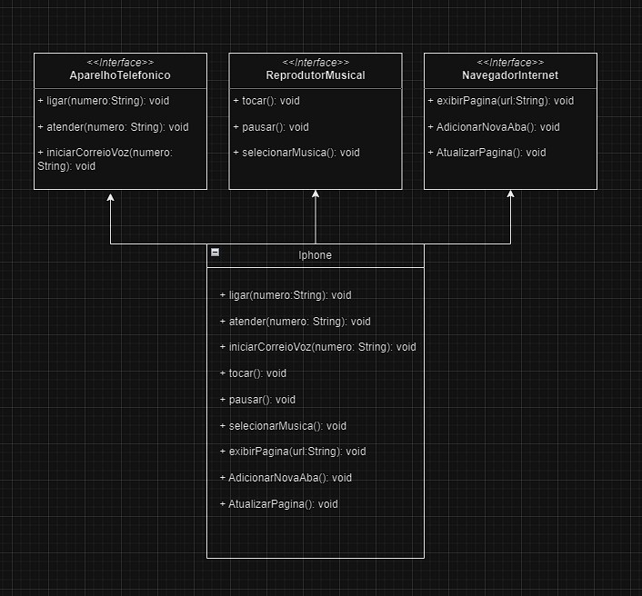

# 📱 Diagramação de classes do iPhone

## 📋 Descrição

Modelagem e diagramação da representação em UML e Código no que se refere ao componente iPhone.

Comportamentos esperados:
Repodutor Musicial: tocar, pausar, selecionarMusica
Aparelho Telefônico: ligar, atender, iniciarCorrerioVoz
Navegador na Internet: exibirPagina, adicionarNovaAba, atualizarPagina

## 📊 Diagrama UML

  

Nesta seção, apresentamos uma explicação detalhada de cada classe representada no diagrama de classe do projeto. Cada classe desempenha um papel específico e contribui para a funcionalidade global do sistema.

### `iPhone`

A classe `iPhone` é a classe principal que representa o dispositivo como um todo. Ela implementa as interfaces `ReprodutorMusical`, `AparelhoTelefonico` e `NavegadorInternet`. Isso permite que o iPhone funcione como reprodutor musical, aparelho telefônico e navegador na Internet. 

### `ReprodutorMusical`

A interface `ReprodutorMusical` define os métodos necessários para controlar a reprodução de música, como `tocar()`, `pausar()` e `selecionarMusica()`. As classes que implementam essa interface são capazes de reproduzir músicas.

### `AparelhoTelefonico`

A interface `AparelhoTelefonico` define os métodos para realizar chamadas telefônicas e enviar mensagens, incluindo `ligar()`, `atender()` e `iniciarCorreioVoz()`. As classes que implementam essa interface podem funcionar como dispositivos telefônicos.

### `NavegadorInternet`

A interface `NavegadorInternet` define métodos para a navegação na web, como `exibirPagina()`, `adicionarNovaAba()` e `atualizarPagina()`. As classes que implementam essa interface podem atuar como navegadores da Internet.

Cada classe ou interface desempenha um papel específico no sistema e contribui para a versatilidade do dispositivo iPhone, tornando-o capaz de realizar uma variedade de funções.

